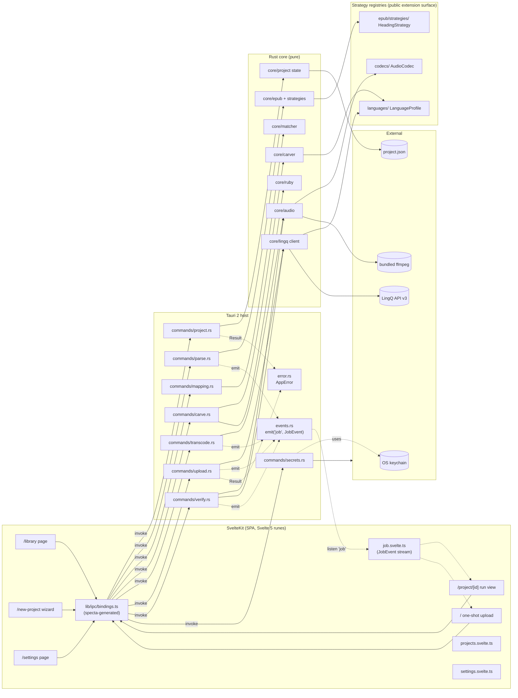

# Component diagram

> Answers: *"Which Rust modules talk to which Svelte stores via which IPC commands?"* Replaces prose in AD-001 through AD-006.

Solid arrows = synchronous `invoke()` request/response. Dashed arrows = event streams (`tauri::Window::emit` / `listen`).

## Read-it-in-30-seconds

- Frontend only talks to backend through `bindings.ts` (specta-generated, never hand-edited).
- Every `#[tauri::command]` returns `Result<T, AppError>`. No `anyhow` at the boundary.
- Every long-running command emits `JobEvent`s on the `"job"` channel; frontend stores subscribe.
- `core/*` is pure Rust — no Tauri imports. Swap-able for a CLI driver if ever needed.
- The three strategy registries (`codecs/`, `languages/`, `epub/strategies/`) are the public extension surface (AD-018).
