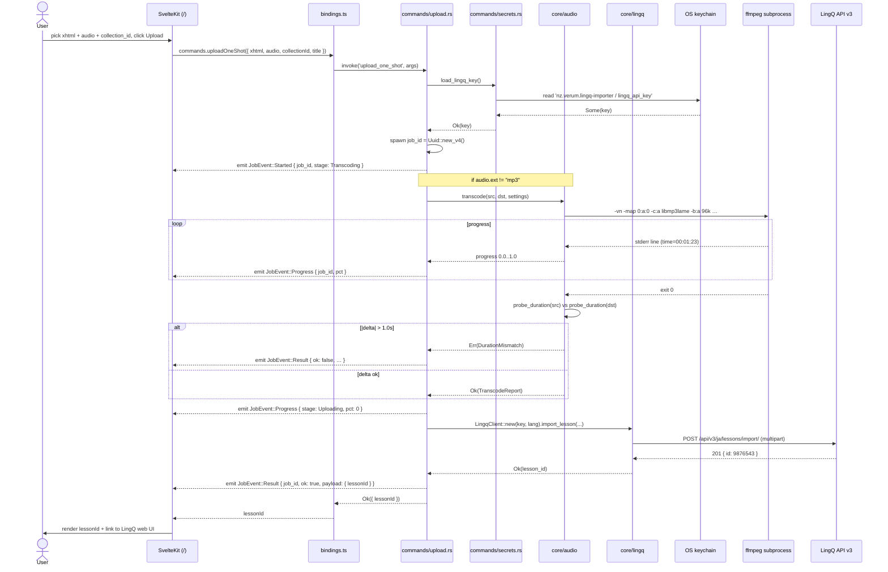

# Import flow — sequence

> Answers: *"What happens when I click Upload on the one-shot screen?"*

## Read-it-in-30-seconds

- Synchronous `invoke()` returns the final result; live progress is decoupled into `JobEvent`s on the `"job"` channel.
- API key is fetched per-call from the OS keychain — never held in memory longer than one command, never serialised to disk.
- ffmpeg progress is parsed from stderr, not stdout. Cancellation = drop the `Child`.
- Failure paths emit `JobEvent::Result { ok: false }` and return `Err(AppError::...)` so the frontend can render both.
