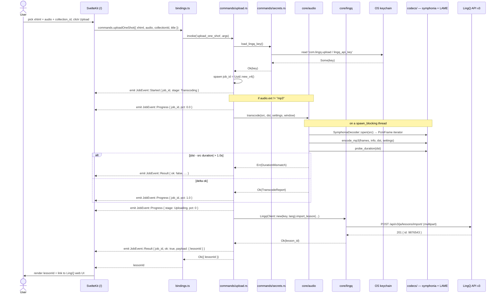

# Import flow — sequence

> Answers: *"What happens when I click Upload on the one-shot screen?"*

```mermaid
sequenceDiagram
  actor User
  participant UI as SvelteKit (/)
  participant IPC as bindings.ts
  participant CmdUp as commands/upload.rs
  participant Sec as commands/secrets.rs
  participant Audio as core/audio
  participant Lingq as core/lingq
  participant Keychain as OS keychain
  participant Codecs as codecs/ — symphonia + LAME
  participant LingqAPI as LingQ API v3

  User->>UI: pick xhtml + audio + collection_id, click Upload
  UI->>IPC: commands.uploadOneShot({ xhtml, audio, collectionId, title })
  IPC->>CmdUp: invoke('upload_one_shot', args)

  CmdUp->>Sec: load_lingq_key()
  Sec->>Keychain: read 'com.lingq.upload / lingq_api_key'
  Keychain-->>Sec: Some(key)
  Sec-->>CmdUp: Ok(key)

  CmdUp->>CmdUp: spawn job_id = Uuid::new_v4()
  CmdUp-->>UI: emit JobEvent::Started { job_id, stage: Transcoding }

  Note over CmdUp,Audio: if audio.ext != "mp3"
  CmdUp-->>UI: emit JobEvent::Progress { job_id, pct: 0.0 }
  CmdUp->>Audio: transcode(src, dst, settings, window)
  Note over Audio,Codecs: on a spawn_blocking thread
  Audio->>Codecs: SymphoniaDecoder::open(src) → PcmFrame iterator
  Audio->>Codecs: encode_mp3(frames, info, dst, settings)
  Audio->>Codecs: probe_duration(dst)
  alt |dst - src duration| > 1.0s
    Audio-->>CmdUp: Err(DurationMismatch)
    CmdUp-->>UI: emit JobEvent::Result { ok: false, … }
  else delta ok
    Audio-->>CmdUp: Ok(TranscodeReport)
    CmdUp-->>UI: emit JobEvent::Progress { job_id, pct: 1.0 }
  end

  CmdUp-->>UI: emit JobEvent::Progress { stage: Uploading, pct: 0 }
  CmdUp->>Lingq: LingqClient::new(key, lang).import_lesson(...)
  Lingq->>LingqAPI: POST /api/v3/ja/lessons/import/ (multipart)
  LingqAPI-->>Lingq: 201 { id: 9876543 }
  Lingq-->>CmdUp: Ok(lesson_id)

  CmdUp-->>UI: emit JobEvent::Result { job_id, ok: true, payload: { lessonId } }
  CmdUp-->>IPC: Ok({ lessonId })
  IPC-->>UI: lessonId
  UI->>User: render lessonId + link to LingQ web UI
```

## Read-it-in-30-seconds

- Synchronous `invoke()` returns the final result; live progress is decoupled into `JobEvent`s on the `"job"` channel.
- API key is fetched per-call from the OS keychain — never held in memory longer than one command, never serialised to disk.
- Transcode is in-process: symphonia decodes to f32 PCM frames, LAME encodes them straight to the destination mp3. The one-shot path reports 0% / 100% around it rather than streaming a percentage; `transcode_batch_sequential` reports per-file for multi-track projects.
- Cancellation is cooperative — a `CancellationToken` raced against the in-flight transcode; partial output is unlinked.
- Failure paths emit `JobEvent::Result { ok: false }` and return `Err(AppError::...)` so the frontend can render both.
