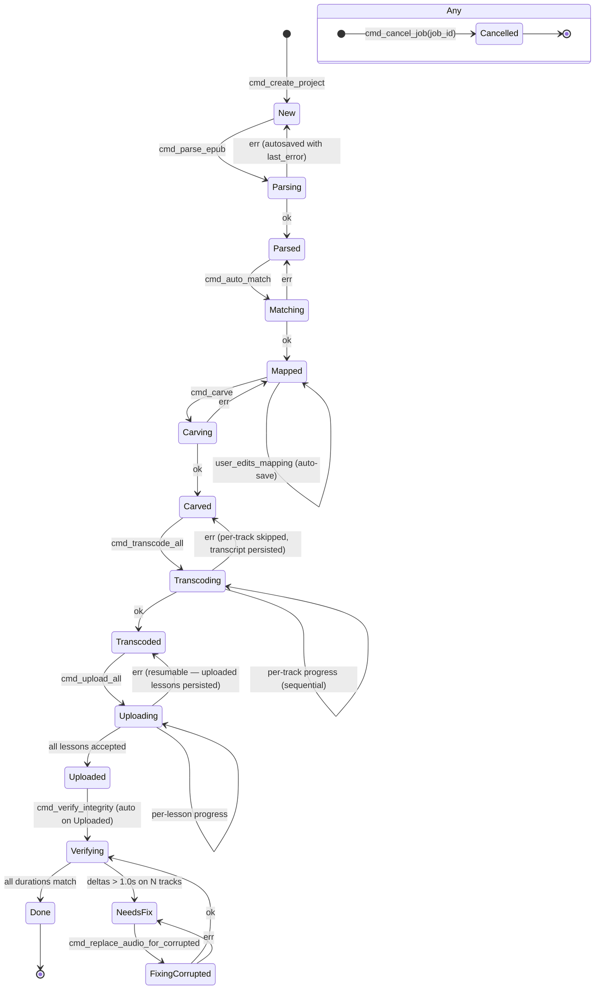

# Project state machine

> Answers: *"What can the UI show for this project right now, and which transitions are legal?"* Drives error model and resumability per AD-007 and AD-010.

## Stage definitions

| Stage | Persisted invariant |
|---|---|
| `New` | sources picked, settings defaulted, no derived data |
| `Parsed` | EPUB headings extracted, `epub.headings[]` populated |
| `Mapped` | `mapping[]` complete, every track has a `headingId` or is explicitly unmapped |
| `Carved` | per-track text materialised, byte-stable |
| `Transcoded` | every track has a verified mp3 with `mp3Sec` within 1.0s of source |
| `Uploaded` | every track has `lingq.lessons[trackId].lessonId` |
| `Verifying` | integrity check in progress (transient) |
| `NeedsFix` | one or more tracks failed integrity vs LingQ-side audio duration |
| `Done` | uploaded + verified + no outstanding issues |

## Resumability contract

- **Every stage transition is atomic.** `project.json` is rewritten via tempfile + rename. A crash mid-stage means the previous stage's snapshot is intact.
- **Stages are idempotent.** Re-running `cmd_transcode_all` on a project already in `Transcoded` is a no-op (per-track `mp3Sec` already present).
- **Per-track granularity inside Transcoding / Uploading.** The job persists each completed track before moving on. Resume after a kill picks up at the next unfinished track.
- **Cancel** is observed as a global event but lands the project in the previous *stable* stage with a partial-progress record (`integrity.byTrack[i]` set for done tracks, absent for the rest).
